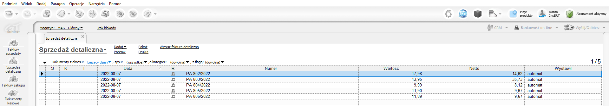

# baselinker_subiekt_integrator


Script creates receipts and invoices in Subiekt GT based on incoming orders from BaseLinker.<br>
After correct creation of receipt/invoice in Subiekt GT order will be moved to selected status.

## Table of contents
- [Installation](#Installation)
- [Configuration](#Configuration)
  - [Installing sqlsrv library](#Installing sqlsrv library)
  - [Installing com_dotnet library](#Installing com_dotnet library)
- [Running script](#Running script)
- [Output](#Output)
- [Contributing](#contributing)
- [License](#license)
- [Code of Conduct](#code-of-conduct)


## Installation
Use git clone to get the script:

```shell
git clone https://github.com/michalkulisiewicz/baselinker_subiekt_integrator.git
```

Install all requirements using pip:

```shell
pip install -r requirements.txt
```

## Configuration 

1. Download and install xampp 7.4.29 / PHP 7.4.29
2. Copy api-subiekt-gt directory to xampp\htdocs
3. Install required php library
4. Configure your firewall for sql server as per instructions in the [link](https://docs.driveworkspro.com/topic/HowToConfigureWindowsFirewallForSQLServer)
5. Go to [link](http://localhost/api-subiekt-gt/public/setup/) to verify installation and to obtain your api key.

### Installing sqlsrv library

1. Go to [link](https://docs.microsoft.com/en-us/sql/connect/php/download-drivers-php-sql-server?view=sql-server-ver16) and download Microsoft Drivers for PHP for SQL Server.
2. Extract files, copy php_sqlsrv_74_ts_x64.dll and php_pdo_sqlsrv_74_ts_x64.dll files and paste them to xampp\php\ext.
3. Edit xampp\php\php.ini go to "Dynamic Extensions" section and add these lines:
```bash 
extension=php_sqlsrv_74_ts_x64.dll
extension=php_pdo_sqlsrv_74_ts_x64.dll
```

### Installing com_dotnet library
1. Go to [link](https://www.pconlife.com/viewfileinfo/php-com-dotnet-dll/) and download dotnet library in version 7.4.5
3. Paste downloaded dll file to xampp\php\ext
4. Edit xampp\php\php.ini go to "Dynamic Extensions" section and add these lines:
```bash 
extension=php_com_dotnet.dll
```

## Running script
Before using a script you need to create configuration file. Run config/create_config_file.py script to do it interactively. <br>
Run main.py to run the script.

## Output


## Contributing

Bug reports and pull requests are welcome on GitHub at
https://github.com/michalkulisiewicz/baselinker_subiekt_integrator. This project is intended to be a safe, welcoming space for collaboration, and contributors are expected to adhere to the [code of conduct](https://github.com/michalkulisiewicz/baselinker_subiekt_integrator/blob/master/CODE_OF_CONDUCT.md).

## License

Project is available as open source under the terms of the [MIT License](https://opensource.org/licenses/MIT).

## Code of Conduct

Everyone that interacts in the project codebase, issue trackers, chat rooms and mailing lists is expected to follow the [code of conduct](https://github.com/michalkulisiewicz/baselinker_subiekt_integrator/blob/master/CODE_OF_CONDUCT.md)


